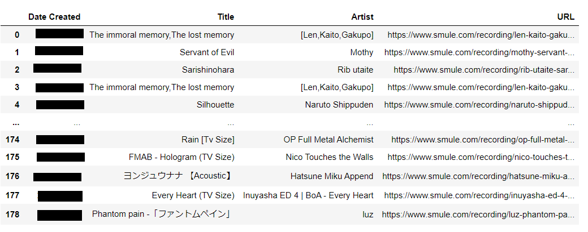

# Smule: Songs List

Get a list of songs (and more) you recorded together with your favorite Smulean~

### Update 4-MAY-2022:
- Quick solution for dealing with 🫖 418 response code (scroll down to LIMITATIONS & WORK-AROUND section!)
- Updated data extraction code to be more concise. Also added `print` statement here and there to keep track of what is going on in the loop.

### Update 6-MAY-2022:
- There's a chance that your loop might not finish when using VPN via ProtonVPN. So you will not be able to get all the song list for users with >5000 recording. Your PC's original IP address will be able to request all the way though (then you will have to wait 1 - 4 weeks..)! 
There's a work around, just annoying:
  - Additional print message was added to indicate the `next_offset`. If the request is not complete, `offset` will need to be change from `0` to whatever the last `next_offset` from the incomplete while-loop.
- Updated repo to only have one main jupyter workbook. VPN solution answers to not having to use multiple jupyter notebooks.

### PURPOSE

Do you have a favorite singing Smulean(s)? Well... I do! Smule doesn't have a good way to show you a list of songs you sang, and I have been wondering how many songs in total I have sung together with my favorite Smuleans!  Never would have thought that my first project outside my coding bootcamp would be for this -and it's already worth all the sweat & tears of going through the bootcamp😭

This entire project is dedicated to getting a list of songs that you sang with your favorite person in the app since the age of time🎤 <em>C'on... it can't just be me who is obsessed with this curiosity</em>🙄

Because there's a limit on the request you can make, you will not have access to Smule web for -I think- 30mins-ish? after you run the code. So, please be advised!

### TOOLS

Everything you need is in the `Resources` folder👍

- Add the username in the `config.py file` (or if you want, you can add the username directly within the code too)

- Run the code in the jupyter notebook
  - You will need the following libraries for this project: `json`, `pandas`, `request`.

- Get a beautiful dataframe which you can export to csv -Done!🎉

### LIMITATIONS & WORK-AROUND
IF after you run the first loop and you get an error in the 2nd loop (the chance is really high unfortunately):
  1. Wait about ...however long (30 mins to 1 month) and run the 2nd loop and the rest of the code.
  1. See WORK-AROUND section below.
  
 <em>I tried adding `time.sleep(2)` and to no avail. Smule doesn't spawn a way to do a proper API request either... because no one cares! 😫😭</em>

#### WORK-AROUND (4-MAY-2022 Update)
Use VPN to get a different IP address when requesting data after the first run! I use [ProtonVPN](https://protonvpn.com/) since it's free! I was able to do multiple runs on the code without waiting (especially nowadays the wait time has increased to 1-week to 1-month...)! It is a little cumbersome to having to disconnect and reconnect to get a different IP address each time, but it is better than waiting for 7-30 days just to get the data!

### FINAL NOTE
(Update) Still to this date (6-MAY-2022), there is still no desginated API or data request from Smule. If anyone finds out otherwise, please do let me know!

Oh! Crediting my [buddy](https://github.com/Dorfnox) for helped looking for the workable url and for walking through my `while` syntax with me🙌

### Update 7-MAR-2021:
- Updated the hardcoding `offset += 25` to use the values from the data, `next_offset`.
- Updated the request and the loop code to update the user with print statement and to handle different response codes.  

### Untracked History & Update for 16-SEP-2020:
I had to trash my repo and re-created it. Previous revision history is not available, but please note the following: 
- The table has been updated to include "Invite Spawner" column.
- This update also included adding the alternative route for obtaining the table of songs if the `main.ipynb` fails to run due to request limits have been attained.
