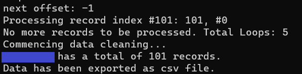

# Smule User's Data

Scrape attempt for some Smule user's app data. `Favorite` playlist only.

The code will give you a csv file and this is what will get printed out:

The number of records (101 in this case) should match with # of recordings shown on the app:

<i>Voila!</i> 🥳

📌 You used to be able to get a list of full-on user's data. As of 2023, Smule team seems to have truncated the data you can get from the 'data source' url: https://www.smule.com/s/profile/performance/username 

The information on the recordings are now only limited to the user's favorite playlist as opposed to all recordings a user has in their account ( including geological location... <i>Maybe that's why they updated it👀</i>)

### Tools
Everything you need is in the `Resources` folder, including instructions.

### Heads-up & Workaround
You will not be able to access Smule app for a while after running this program: 

You may also not be able to `request` the data after 1-2 runs. 

As a workaround, I use [ProtonVPN](https://protonvpn.com/) to use a different IP address to get the data (it's free!). 

It is a little cumbersome to having to disconnect and reconnect to get a different IP address each time if you want to get multiple sets of data, but it is better than waiting for 7-30 days just to get the data... and unable to use your app 😒

### Context and Lament
[Smule](https://www.smule.com/) is a social singing app you can use to sing either on your own or with others. I was obssessed with trying to get my user's data because I have favorite people that I sing with, so I created this program to do that.

Unfortunately, Smule does not have any sort of API endpoints where you can get your data easily. After a bunch of googling, I came across a URL (mentioned above) where you can put <i>anyone's username</i> for the user's parameter and you will get a json data. <i> Nope! Not secure at all. </i> 

<i>Have I tried emailed Smule team about this?</i> Yes! They basically wish me luck using what I have and that was it.