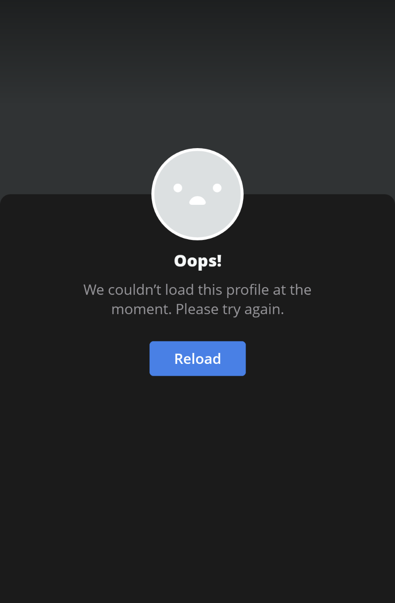

# Smule: Songs List

Scrape attempt for some Smule user's app data 😒

>Get a list of songs (and more) you recorded together with your favorite Smulean! 

👆 That was the case back in 2021.

⛔ As of 2023, Smule team seems to have truncated the data you can get from the 'data source' URL: https://www.smule.com/s/profile/performance/username 

The information on the recordings are only limited to the user's favorite directory as opposed to all recordings a user has in their account.

### TOOLS
Everything you need is in the `Resources` folder.

- Add the username in the `config.py file` (or if you want, you can add the username directly within the code too)

- Run the code in the jupyter notebook
  - You will need the following libraries for this project: `json`, `pandas`, `request`.

### Heads-up
You will not be able to access Smule app for a while after running this program: 

You may also not be able to `request` the data after 1-2 runs. As a workaround, I use [ProtonVPN](https://protonvpn.com/) (it's free!) 

It is a little cumbersome to having to disconnect and reconnect to get a different IP address each time, but it is better than waiting for 7-30 days just to get the data... and unable to use your app 😒

### Context and Lament
[Smule](https://www.smule.com/) is a social singing app you can use to sing either on your own or with others. I was obssessed with trying to get my user's data because I have favorite people that I sing with, so I created this program to do that.

Unfortunately, Smule does not have any sort of API endpoints where you can get your data easily. After a bunch of googling, I came across a URL (mentioned above) where you can put <i>anyone's username</i> for the user's parameter and you will get a json data. <i> Nope! Not secure at all. </i> 

Have I tried emailed Smule team about this? Yes, and they basically wish me luck using what I have and that was it.